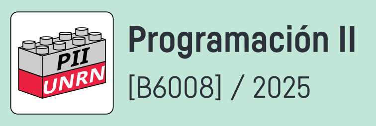

# cursada-2025

Este repositorio contiene el material utilizado en la cursada 
de la cátedra Programación 2 (B6008) de la carrera Ingeniería 
en Computación de la Universidad Nacional de Rio Negro, sede 
Andina.

## [Grabaciones de las clases](https://www.youtube.com/playlist?list=PLnCeTGruNF6mveEBpfF2vXorYLLMAN9f7)
La lista de reproducción en Youtube con las grabaciones.

## Extras

[Javadoc 21](https://docs.oracle.com/en/java/javase/21/docs/api/index.html)
No le vamos a dar uso inmediato, pero se los dejo a mano.

---

