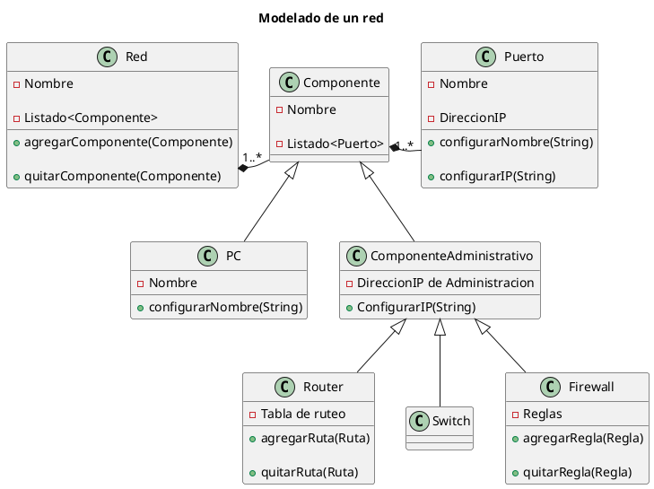

 
# Red empresarial


## Contexto


Se busca modelar una red empresarial utilizando como componentes routers, switches, PCs. Estos elementos podrán intercambiar mensajes (paquetes de red). El sistema permitirá administrar los componentes (altas/bajas) y manejar así diversas redes en la empresa.


## Componentes


- **Red**: a la que se le agregarán los componentes requeridos


- **Router**: permite comunicar 2 o más redes entre sí a través de los puertos que tenga


- **Switch**: permite comunicar componentes de una misma red a través de los puertos que tenga


- **Firewall**: permite tomar decisiones sobre el ruteo/permiso de paso de los mensajes


- **Puerto**: es la interfaz de red que tienen los componentes para poder enviar y recibir mensajes de los otros componentes


- **PC**: una computadora que se conectará a los otros componentes mediante interfaces de red (puertos)


## Atributos de los componentes


#### Red


- Nombre

- Listado de componentes contenidos


#### Router


- Nombre

- Dirección IP de administración

- Dos o más puertos

- Tabla de ruteo


#### Switch


- Nombre

- Dirección IP de administración

- Cuatro o más puertos


#### Firewall


- Nombre

- Dirección IP de administración

- Dos o más puertos

- Reglas


#### PC


- Nombre

- Uno o más puertos


#### Puerto


- Nombre

- Dirección IP


## Comportamiento


La red debe contener al menos un router para poder conectarse a Internet. Con esto consideramos que puede quedar definida la red, aunque para un uso mínimo real se requiere una PC para poder hacer uso de ese recurso a través del router.

Se podrán agregar/quitar componentes de la red que deberán configurarse con su propia IP.


Este es el esquema básico de la red. Se puede ver que se generarán varias otras clases como IP para utilizar en cada configuración como en también en las tablas de ruteo.

NOTA: El codigo UML se puede generar pegando el codigo en www.plantuml.com/plantuml (sin las linea de comienzo y fin con ```)

